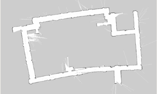

# 🤖 Pepper Campus Guide Robot (LLM 기반 안내 로봇)

이 프로젝트는 **휴머노이드 로봇 Pepper**를 활용하여 **LLM(ChatGPT)** 기반의 **자율주행 캠퍼스 안내 로봇**을 설계 및 개발한 프로젝트입니다.  
음성 인식 및 터치 기반의 **NUI(Natural User Interface)**를 통해 사용자와 자연스럽게 상호작용하며, 실내 내비게이션을 통한 안내 기능을 수행합니다.

---

## 📆 프로젝트 개요

- **프로젝트명**: Pepper를 이용한 LLM 기반 캠퍼스 안내 로봇  
- **개발 기간**: 6개월  
- **프로젝트 인원**: 5명

---

## 🧰 기술 스택

- **백엔드**: Socket, ROS, Flask  
- **프론트엔드**: Flask, HTML  
- **개발 언어**: Python 2, Python 3  
- **운영 체제**: Ubuntu 18.04  
- **사용 기술**: Navigation, SLAM, LLM(ChatGPT)  
- **사용 도구**: 피그마, Git, WSL  
- **사용 API**: Google TTS API, GPT API

---

## 🧩 담당 기능

- Navigation, SLAM 등의 자율주행에 필요한 알고리즘 적용 및 파라미터 조정  
- GPT API 연동 및 활용 예제 구현

---

## 📝 프로젝트 요약

이 프로젝트는 LLM(ChatGPT) 모델을 활용하여 음성 인식 및 터치가 가능한 **NUI 기반 인터페이스**를 통해  
사용자에게 캠퍼스 정보를 안내할 수 있는 Pepper 로봇을 설계하고 실제 환경에서 개발 및 테스트한 프로젝트입니다.

---

## 📸 데모 이미지 및 영상

>[ (※ 네비게이션 작동 영상)](https://www.youtube.com/shorts/9QvCRJi_8eQ)

---

## 🏁 향후 발전 방향

- 실외 내비게이션 연동 및 실시간 지도 업데이트  
- 멀티모달 입력(카메라, 제스처 등)을 활용한 사용자 경험 확장  
- 더 정교한 음성 인식 및 자연스러운 대화 흐름 개선

---

## 🧱 시스템 아키텍처

- **Navigation**:  
  ROS의 `move_base` 패키지를 기반으로, DWA, A\*, AMCL 알고리즘을 적용하여 실내 자율주행 기능 구현

- **SLAM**:  
  Gmapping 기반 SLAM을 사용하여 지도 생성 및 위치 추정 수행

- **키워드 인식 / STT**:  
  SoftBank Noaqi SDK에서 제공하는 음성 인식 기능을 활용

- **TTS (Text-to-Speech)**:  
  Google TTS API를 사용하여 음성을 생성하고 사용자에게 안내

- **LLM(ChatGPT)**:  
  GPT API를 연동하여 대화형 응답 및 행동 제어 가능 (예: 음성 명령에 따라 움직임 실행)

- **웹 인터페이스**:  
  Flask를 기반으로 웹 연동 및 외부 데이터 처리 수행

---
## 🔁 업무 프로세스 및 모션 설계

### ✅ 업무 프로세스 #1 — SLAM 테스트

Pepper의 Laser 센서 및 메인 컴퓨터 성능 한계를 극복하기 위해 다양한 SLAM 알고리즘을 비교 및 테스트했습니다.  

#### 🔍 사용한 SLAM 방식 비교

<table>
  <tr>
    <td align="center"><b>Hector SLAM</b></td>
    <td align="center"><b>Cartographer</b></td>
    <td align="center"><b>Gmapping</b></td>
  </tr>
  <tr>
    <td></td>
    <td></td>
    <td></td>
  </tr>
</table>

### ✅ 업무 프로세스 #2 — Navigation 적용 및 시각화
- ROS `Navigation` 패키지 적용 및 파라미터 조정
- `rviz`를 통해 로봇 위치 및 경로 시각화
- move_base 프레임워크를 기반으로 실내 내비게이션 시스템 구축

### ✅ 업무 프로세스 #3 — GPT 기반 음성 대화 설계
- GPT API 연동을 통해 음성 대화를 기반으로 로봇의 다양한 동작과 내비게이션 제어 가능하도록 설계
- 단순 질의응답이 아닌 **상황에 따라 유도적인 행동**이 가능하도록 자연어 처리 연계

---

## 🕹️ 사용 가능 모션 목록

| 기능 종류 | 예시 모션 |
|-----------|------------|
| 위치 이동 | 위치 안내, 단순 이동 |
| 촬영 및 연출 | 사진 촬영, 음악 연주 |
| 상호작용 | 동물 흉내, 감정 표현, 기타 치기 등 |

로봇의 동작은 상황에 따라 커스터마이징이 가능하며, 음성 명령과 연동되어 실시간으로 수행됩니다.

## 🙋‍♂️ 문의

**최윤석**  
📧 nim451@naver.com

